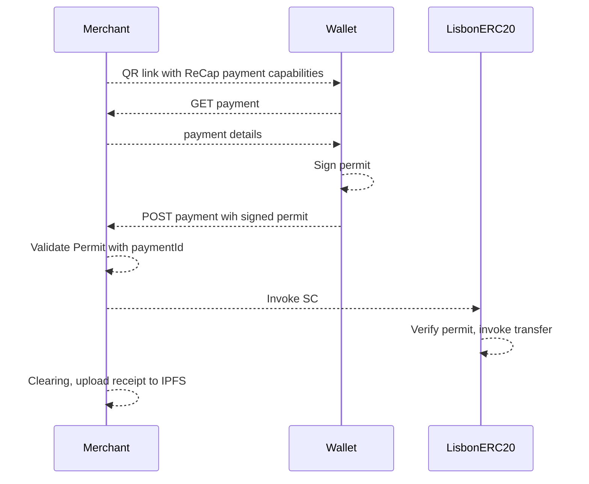

# walletcon-payment-hacks

```mermaid
sequenceDiagram
    Merchant-->>Wallet: QR link with ReCap payment capabilities
    Wallet-->>Merchant: GET payment
    Merchant-->>Wallet: payment details
    Wallet-->>Wallet: Sign permit
    Wallet-->>Merchant: POST payment wih signed permit
    Merchant-->>Merchant: Validate Permit with paymentId
    Merchant-->>LisbonERC20: Invoke SC
    LisbonERC20-->>LisbonERC20: Verify permit, invoke transfer
    Merchant-->>Merchant: Clearing, upload receipt to IPFS
```
