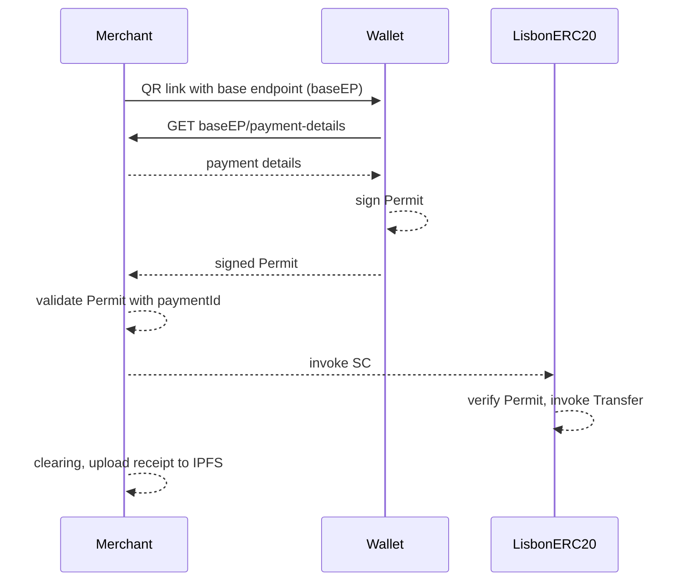

# walletcon-payment-hacks

```mermaid
sequenceDiagram
    Merchant->>+Wallet: QR link with base endpoint (baseEP)
    Wallet->>+Merchant: GET baseEP/payment-details
    Merchant-->>Wallet: payment details
    Wallet-->>Wallet: sign Permit
    Wallet-->>Merchant: signed Permit
    Merchant-->>Merchant: validate Permit with paymentId
    Merchant-->>LisbonERC20: invoke SC
    LisbonERC20-->>LisbonERC20: verify Permit, invoke Transfer
    Merchant-->>Merchant: clearing, upload receipt to IPFS
```
